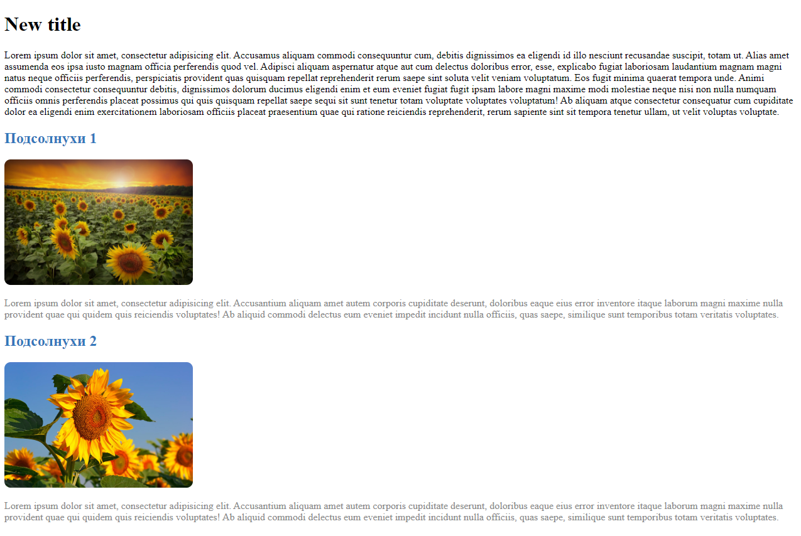

## Продолжение JavaScript
### Урок 10. Семинар. Работа с JSON

\
[Домашнее задание (код)](homework.js)

Задание 1 (повторить то, что делали на семинаре)
1. Создать файл index.html.
2. Подключить data.js.
3. Сформировать контент из данных (картинка заголовок и параграф).
4. Добавить данный контент в вёрстку.
5. \* Добавить стили при необходимости (по желанию).