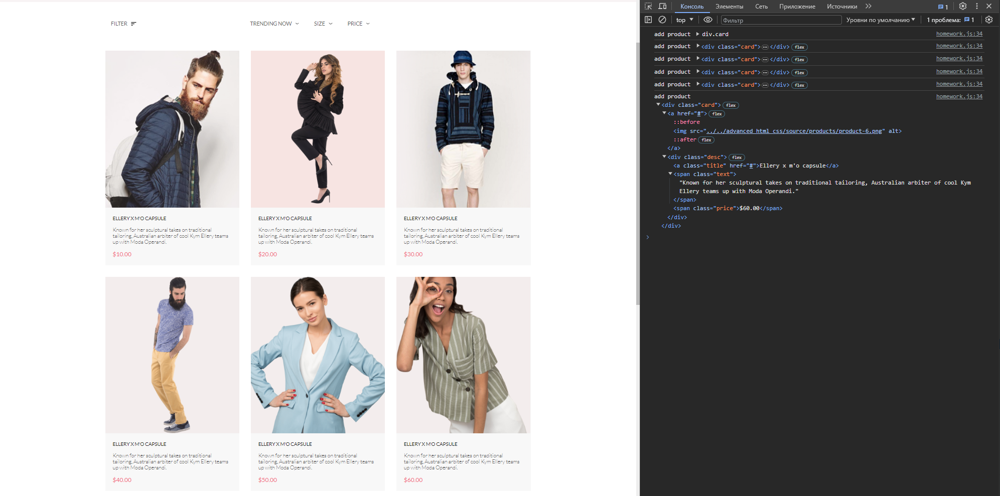

## Продолжение JavaScript
### Урок 11. Семинар. Шаблонизация

Семинар (код: [index.html](index.html), [script.js](script.js), [data.js](data.js))

\
Домашнее задание (код: [homework.html](homework.html), [homework.js](homework.js), [dataHomework.js](dataHomework.js))

Повторить то, что на семинаре, либо решить следующее задание
1. Дан [макет сайта](https://www.figma.com/file/mnLY69cYE5cqWM5w6n5hXx/Seo-%26-Digital-Marketing-Landing-Page?node-id=190%3A1194&t=q4NMnXTnwyyTSGA6-0)
2. В блоке Featured Items необходимо реализовать шаблон товаров.
3. Для этого необходимо создать [json формат данных](dataHomework.js) по всем товарам.
4. Из этого файла сформировать блок Featured Items.
5. Всю вёрстку остальных частей реализовывать не нужно, если у вас она [была сделана](../../advanced_html_css/lesson_6) на html/css можно использовать, заново создавать не требуется.