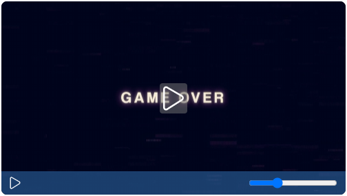
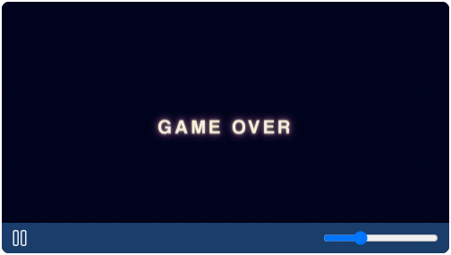
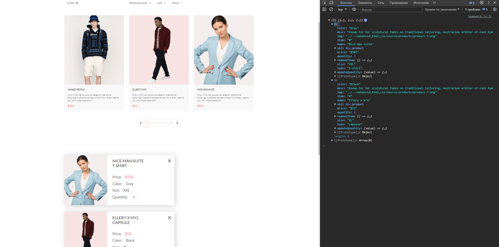

## Продолжение JavaScript
### Урок 13. Семинар. Работа с медиа

\
Семинар (код: [index.html](index.html), [script.js](script.js), [style.css](style.css))

\
Домашнее задание (код: [homework.html](homework.html), [homework.js](homework.js), [dataHomework.js](dataHomework.js))

Доделать дизайн плеера с семинара (можно добавить еще функционала), либо решить следущее задание:
1. Дан [макет сайта](https://www.figma.com/file/mnLY69cYE5cqWM5w6n5hXx/Seo-%26-Digital-Marketing-Landing-Page?node-id=4203%3A2&t=q4NMnXTnwyyTSGA6-0)
2. На предыдущем уроке вы [сформировали данные](dataHomework.js) из раздела "Товары".
3. При клике на кнопку add to cart у товара под блоком с акциями появляется раздел Cart items.
4. В разделе Cart items появляются товары, добавленные в корзину.
5. При клике на крестик, товар удаляется из раздела корзины, если удалить все товары, раздел полностью пропадает.