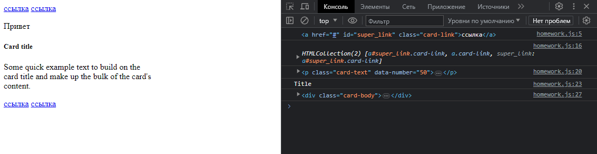
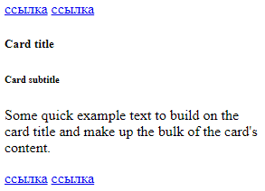
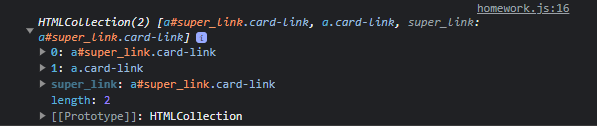
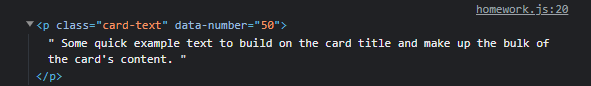
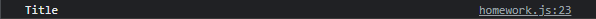
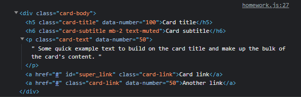
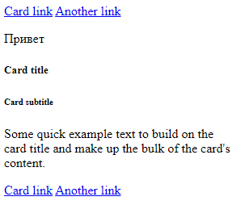
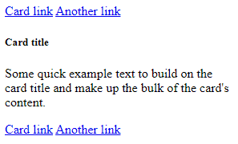

## Продолжение JavaScript
### Урок 2. Семинар. Введение в DOM (Document Object Model)

\
[Домашнее задание (код)](homework.js)

<details><summary>Скриншоты по пунктам</summary>

1. Найти по id, используя getElementById, элемент с id равным "super_link" и вывести этот элемент в консоль.\
   
2. Внутри всех элементов на странице, которые имеют класс "card-link", поменяйте текст внутри элемента на "ссылка".\
   
3. Найти все элементы на странице с классом "card-link", которые лежат в элементе с классом "card-body" и вывести полученную коллекцию в консоль.\
   
4. Найти первый попавшийся элемент на странице у которого есть атрибут data-number со значением 50 и вывести его в консоль.\
   
5. Выведите содержимое тега title в консоль.\
   
6. Получите элемент с классом "card-title" и выведите его родительский узел в консоль.\
   
7. Создайте тег `p`, запишите внутри него текст "Привет" и добавьте созданный тег в начало элемента, который имеет класс "card".\
   
8. Удалите тег h6 на странице.\
   

```html
<a href="#" class="card-link">Card link</a>
<a href="#" class="card-link">Another link</a>

<div class="card" style="width: 18rem;">
    <div class="card-body">
        <h5 class="card-title" data-number="100">Card title</h5>
        <h6 class="card-subtitle mb-2 text-muted">Card subtitle</h6>
        <p class="card-text" data-number="50">
            Some quick example text to build on the card title and make up the bulk of the card's
            content.
        </p>
        <a href="#" id="super_link" class="card-link">Card link</a>
        <a href="#" class="card-link" data-number="50">Another link</a>
    </div>
</div>

<script>
    "use strict";
```

</details>