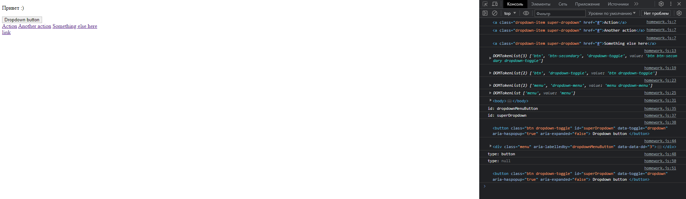
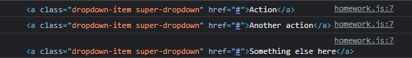
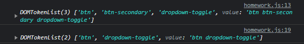
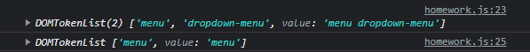
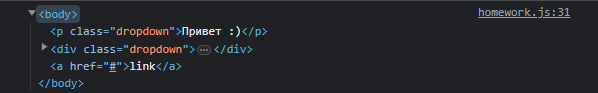
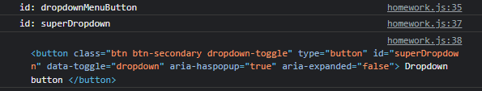
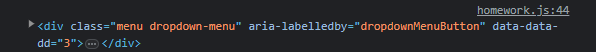
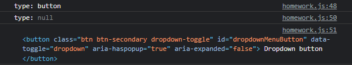

## Продолжение JavaScript
### Урок 4. Семинар. Работа с DOM

\
[Домашнее задание (код)](homework.js)

<details><summary>Скриншоты по пунктам</summary>

1. Ко всем элементам, имеющим класс "dropdown-item" добавить еще один класс "super-dropdown", необходимо использовать методы forEach и querySelectorAll и свойство classList у элементов.\
   
2. У элемента с классом btn необходимо убрать класс "btn-secondary", если он присутствует у этого элемента, либо добавить, если такого класса у элемента не было.\
   
3. Необходимо удалить класс "dropdown-menu" у элемента, у которого присутствует класс "menu".\
   
4. Используя метод insertAdjacentHTML добавьте после div'a с классом "dropdown" следующую разметку: `<a href="#">link</a>`\
   
5. У элемента с id "dropdownMenuButton" замените id на "superDropdown".\
   
6. Добавьте атрибут data-dd со значением 3 элементу у которого существует атрибут "aria-labelledby" равный "dropdownMenuButton" используя dataset.\
   
7. Удалите атрибут type у элемента с классом "dropdown-toggle".\
   

```html
<p class="dropdown">Привет :)</p>
<div class="dropdown">
   <button
           class="btn btn-secondary dropdown-toggle"
           type="button"
           id="dropdownMenuButton"
           data-toggle="dropdown"
           aria-haspopup="true"
           aria-expanded="false"
   >
      Dropdown button
   </button>
   <div class="menu dropdown-menu" aria-labelledby="dropdownMenuButton">
      <a class="dropdown-item" href="#">Action</a>
      <a class="dropdown-item" href="#">Another action</a>
      <a class="dropdown-item" href="#">Something else here</a>
   </div>
</div>

<script>
    "use strict";
```

</details>