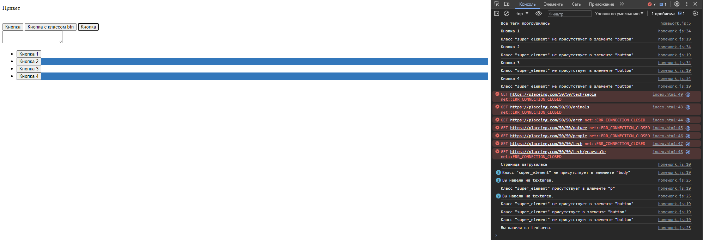
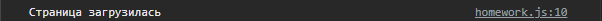
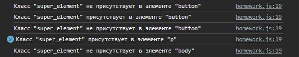
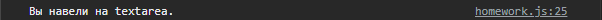
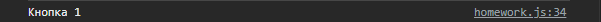
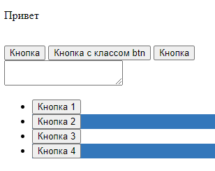

## Продолжение JavaScript
### Урок 6. Семинар. Основы событий в JavaScript

\
[Домашнее задание (код)](homework.js)

<details><summary>Скриншоты по пунктам</summary>

1. Необходимо вывести сообщение в консоль "все теги прогрузились", когда все теги будут созданы браузером.\
   

2. Необходимо вывести сообщение в консоль "страница загрузилась", когда все ресурсы страницы будут загружены.\
   

3. При клике на какой-либо тег на странице в консоль должно выводиться сообщение наподобие:
   - Класс "super_element" присутствует в элементе "div".
   - сообщение должно определять присутствует или отсутствует класс "super_element"
   - у элемента, а также выводить в нижнем регистре верный тег в данной строке, по которому был совершен клик.
   - Необходимо использовать делегирование.\
   

4. Сделайте, чтобы при наведении на textarea в консоли появлялось сообщение: "Вы навели на textarea."\
   

5. Необходимо повесить событие клика на тег `ul`.
   - В обработчике события в консоль необходимо выводить текст, который записан внутри элемента кнопки, по которой был произведен клик.
   - Если клик был не по кнопке, то ничего выводить не нужно.
   - Необходимо использовать делегирование.

   

6. Вопрос: Почему в console.log пишется сначала текст из 5 задания и только потом выводится текст из 3 задания, если мы кликаем по
   кнопкам в `ul`? Ответ необходимо написать здесь же, под этим комментарием, своими словами.
   - #### **Сначала отрабатывает событие элемента, после - событие его родителя и тд. вверх по DOM дереву (если не отключить, `e.cancelBubble = true`)**

7. С помощью JS необходимо изменить цвет заднего фона каждого второго тега li.\
   

```html
<p class="super_element">Привет</p>


<br>

<button>Кнопка</button>
<button class="super_element">Кнопка с классом btn</button>
<button>Кнопка</button>

<br>

<textarea></textarea>

<br>

<ul>
   <li>
      <button>Кнопка 1</button>
   </li>
   <li>
      <button>Кнопка 2</button>
   </li>
   <li>
      <button>Кнопка 3</button>
   </li>
   <li>
      <button>Кнопка 4</button>
   </li>
</ul>

<script>
   "use strict";
```

</details>