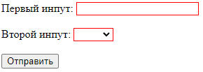

## Продолжение JavaScript
### Урок 8. Семинар. Работа с событиями

\
[Домашнее задание (код)](homework.js)

<details><summary>Скриншоты по пунктам</summary>

1. При изменении значения в input с `id="from"`, значение содержащееся в нем должно моментально отображаться в `span`.
   То есть при печати в input'е тег `span` также должен меняться.\
   

2. При клике на кнопку с классом messageBtn необходимо элементу с классом message:
   - добавить два класса: `animate_animated` и `animate_fadeInLeftBig`
   - поставить данному элементу стиль `visibility` в значение `visible`.

   

3. Необходимо при отправке формы проверить, заполнены ли все поля в этой форме. Если какое-либо поле не заполнено, форма
   не должна отправляться, также должны быть подсвечены незаполненные поля (необходимо поставить класс `error`
   незаполненным полям). Как только пользователь начинает заполнять какое-либо поле, необходимо, при вводе в данное
   поле, произвести проверку:
   - Если поле пустое, необходимо данное поле подсветить (поставить класс `error` данному полю).
   - Если поле было чем-либо заполнено, подсветку (класс `error`) необходимо убрать.
   
   
   

```html
<input id="from" type="text">
В инпуте написано: <span></span>

<br>

<button class="messageBtn">Показать блок</button>
<div class="message">
   Привет :)
</div>

<br>

<form>
   <label>
      Первый инпут:
      <input class="form-control" type="text">
   </label>
   <br>
   <br>
   <label>
      Второй инпут:
      <select class="form-control">
         <option value=""></option>
         <option value="1">Один</option>
         <option value="2">Два</option>
      </select>
   </label>
   <br>
   <br>
   <button>Отправить</button>
</form>

<script>
   "use strict";
```

</details>