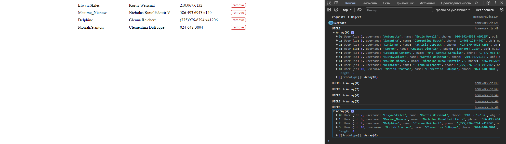

## JavaScript про ECMAScript
### Урок 4. Асинхронность в Javascript

\
Домашнее задание: [index.html](index.html), [homework.js](homework.js)

- Задание 1
  - Необходимо получить список всех пользователей с помощью бесплатного [API](https://jsonplaceholder.typicode.com/users) и отобразить их на странице.
  - Пользователь должен иметь возможность удалить любого пользователя из списка.
- Задание 2 (* необязательная задача) - не делал
  - Необходимо реализовать отрисовку 10 картинок собак из [API](https://dog.ceo/dog-api/) с интервалом в 3 секунды.